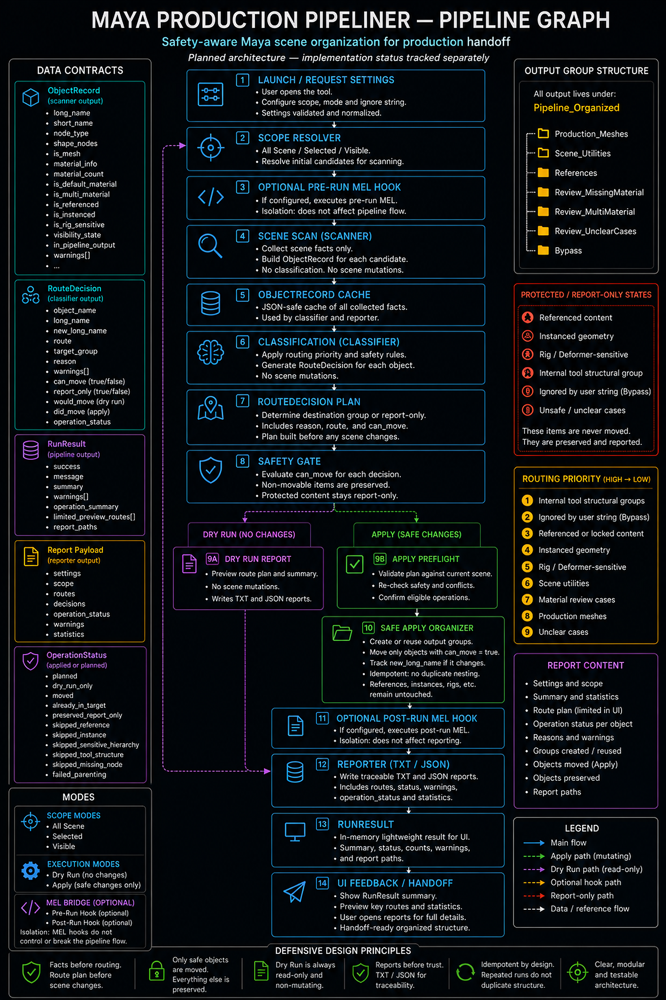

# Pipeline Overview

This document summarizes the intended pipeline shape and the module boundaries used by Maya Production Pipeliner.

For defensive rationale and safety framing, see [`defensive_design.md`](defensive_design.md).

## Pipeline Flow

```text
Maya scene
-> scanner
-> ObjectRecord facts
-> classifier
-> RouteDecision plan
-> Dry Run or Apply
-> reporter
-> RunResult
```

The route plan is central. The tool decides what it intends to do before any scene mutation is executed.

## Current Implementation Boundary

Current validated slices support:

* scene scanning;
* route classification;
* Dry Run reporting;
* Apply: group structure creation, object movement, idempotency, already-in-target detection, failure handling;
* utility routing;
* unclear-case routing;
* manual validation slices recorded in the checklist.

## Implementation Status Snapshot

The repository is no longer only scaffold. The current state is better understood in three buckets:

### Runtime code already in use

* `scanner.py` performs real scene scanning;
* `classifier.py` produces real route decisions;
* `reporter.py` writes real TXT/JSON reports;
* `pipeline.py` runs the end-to-end Dry Run and Apply flow;
* `organizer.py` creates group structure and moves eligible route decisions in Apply mode;
* `config.py` defines the active constants and contracts used by runtime modules.

### Partial or scaffold-heavy modules

* `ui.py` implements the Phase 7 minimal UI; Dry Run and Apply flows smoke validated in Maya 2027.1;
* `launcher.py` is the intended entry point and smoke validated alongside `ui.py`;
* `mel_bridge.py` is isolated but still depends on broader optional-behavior validation;
* `install.py` is a setup helper, not the core runtime workflow.

### Remaining open behavior

* leaf object reclassification inside `Pipeline_Organized` after user edits (Test 19);
* full release gate validation (Test 28 documentation check, final checklist pass).

## Module Responsibilities

```text
config.py      -> names, constants, modes, routes, and status values
scanner.py     -> reads scene facts and builds ObjectRecord data
classifier.py  -> creates RouteDecision data from factual records
organizer.py   -> creates Apply groups and moves eligible route decisions
reporter.py    -> writes TXT/JSON reports
pipeline.py    -> orchestrates scan, classify, organize, report, RunResult
ui.py          -> lightweight Maya-facing interface
launcher.py    -> public launch entry point
mel_bridge.py  -> isolates optional MEL compatibility hooks
```

## Output Group Model

The architecture targets a readable Outliner structure rooted under:

```text
Pipeline_Organized
```

Planned child groups:

```text
Production_Meshes
Scene_Utilities
References
Review_MissingMaterial
Review_MultiMaterial
Review_UnclearCases
```

This structure is created by the current Apply runtime. Eligible Production_Meshes, Scene_Utilities, material-review, and safe unclear routes now move under Apply; already-in-target detection and related follow-through remain tracked by the checklist and validation artifacts.

Ignored content matched by the user-defined ignore string should be preserved outside the normal organized output buckets unless a future contract explicitly says otherwise.

## Architecture Graph

The current visual architecture graph is included here:



Use the graph as a visual overview. Treat implementation status as tracked separately by the checklist, planning docs, and current runtime code.
